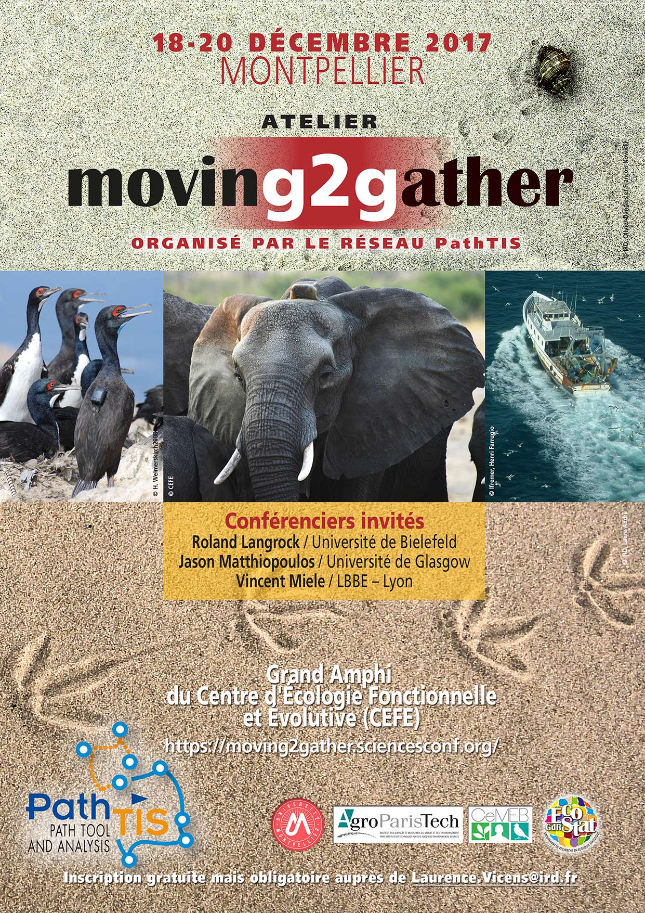

The workshop Moving2Gather is organized every two years since 2015. 

- First edition of the Moving2Gather workshop was held in Nantes on December 7-10, 2015. 

    [Link](https://moving2gather.sciencesconf.org/program/details) to the program.

- Second edition took place in Montpellier on December 18-20, 2017. 

    [Link](https://m2g-2017.sciencesconf.org/program/details) to the program.
    
    Downlowd the keynote presentations [here](docs/KeynoteSpeakers.zip).

    